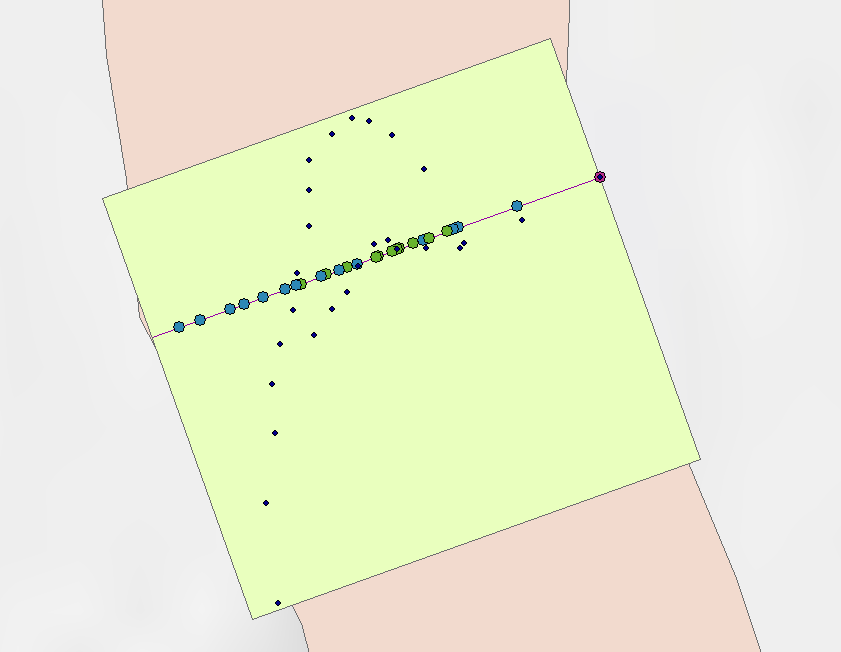
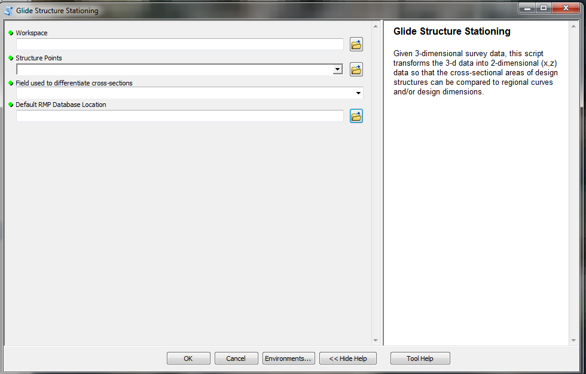
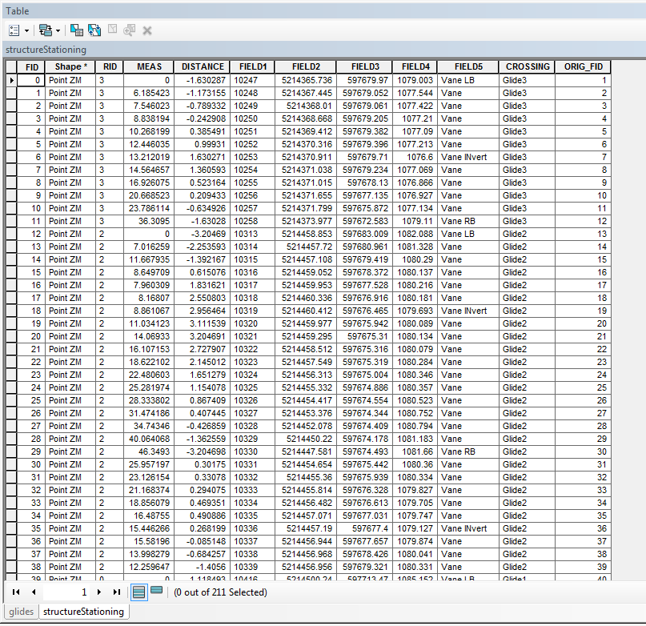
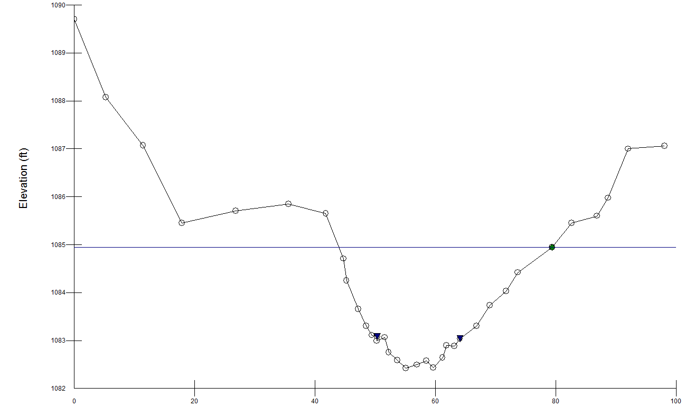

# Glide Stationing (StructureStationingScript.py)
## Synopsis

This [script] (StructureStationingScript.py) was developed to create a two-dimensional profile of a three-dimensional survey for use in river restoration. Structure surveys need to be converted so that two-dimensional areas can be computed and related to regional curves. Survey data is then added to a database using SQL and command line.

## Script Inputs

*For the ArcGIS script execution, the following inputs are needed:*
+ Workspace (file directory)
+ The original 3-dimensional structure points
+ The field used to differentiate to various glide structures
+ Default database location

## Motivation

River restoration's are constructed in 3-dimensions.  It is very difficult to perform a detailed 3-dimensional survey for the use in calculating appropriate metrics for construction.  Many of the structures used in river restoration need to be scaled to certain widths, depths, and areas.  It is easier to scale all of the 3-dimensional data into 2-dimesional so these various structures can be compared to each other.  Structure data is imported and manipulated into an Access database using SQL code within python.

## Installation

Download the [ArcToolbox] (StructureStationing.tbx) and [script] (StructureStationingScript.py) to try in ArcGIS. Make sure to save them in the same folder directory.

## Tests

This script was developed and tested with ArcGIS 10.2, Python 2.7

Python modules needed: *arcpy, pyodbc, shutil, os, time*

## Contributors

Michael Harris is the author of this script.

[StackOverflow] (http://stackoverflow.com/users/4530995/michael-harris)

[LinkedIN] (https://www.linkedin.com/in/michael-harris-366b0060/)

## License

This code is available under the [MIT License.] (LICENSE)

